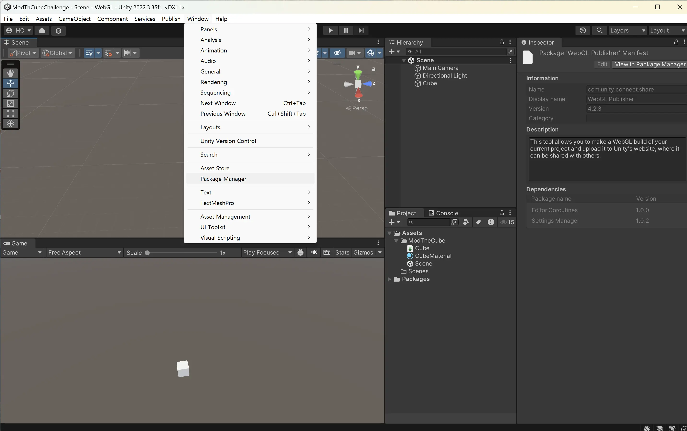
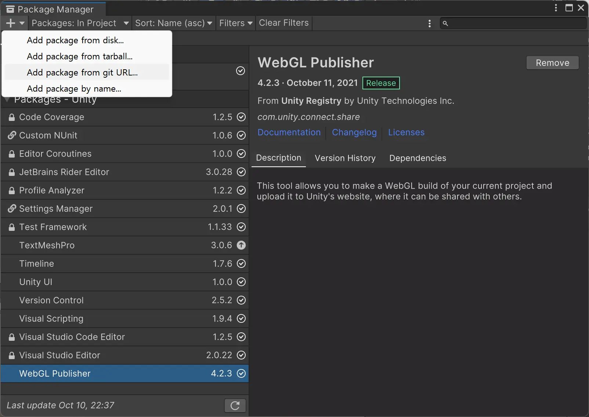
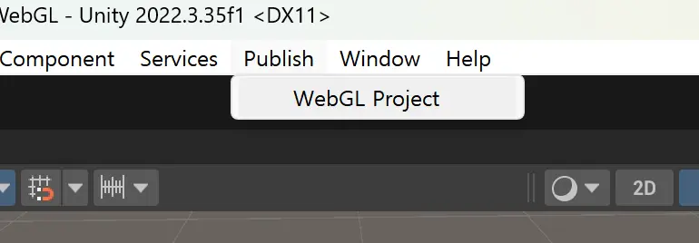
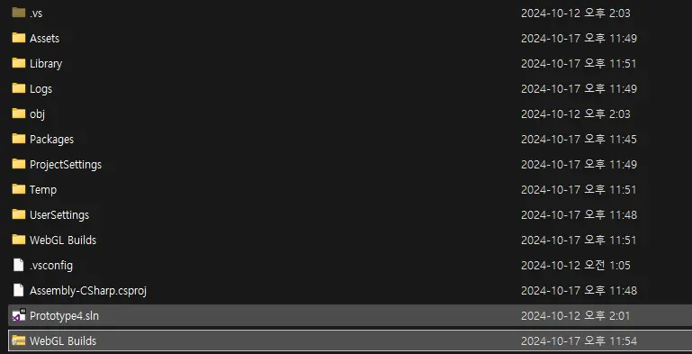
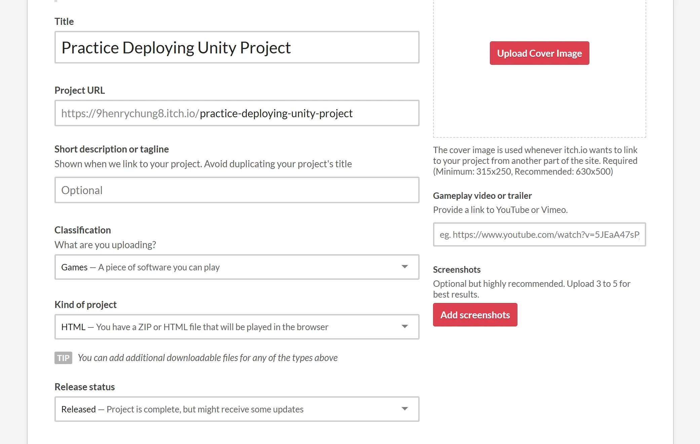
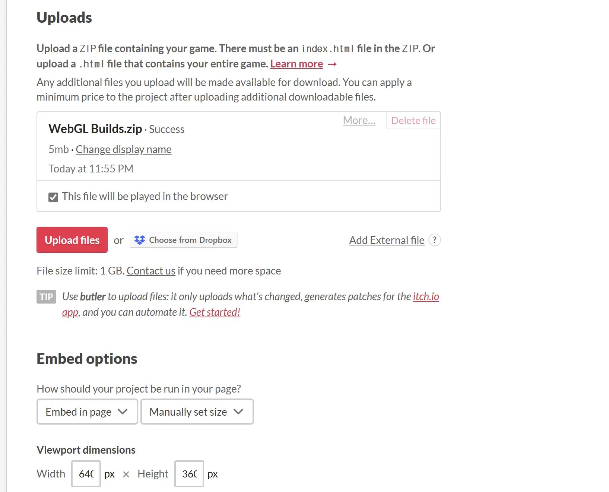

#### 1. Setup Unity WebGL Publisher

Go to **Window → Package Manager**.



Click the **+** dropdown menu and select **Add package from git URL**.



Enter the package URL:

```bash
com.unity.connect.share
```

The **Publish** tab will now appear in Unity.



#### 2. Deploy to play.unity.com

Click **Build and Publish**. The Unity publish window will open where you can add your title and description.

#### 3. Deploy to itch.io

###### Prepare Build Files

Zip your WebGL build folder.



###### Upload to itch.io

Select **HTML** or **HTML5** as the project kind.



Upload your zip file and check **"This file will be played in the browser"**.

Adjust the resolution under **Embed options** if needed.


